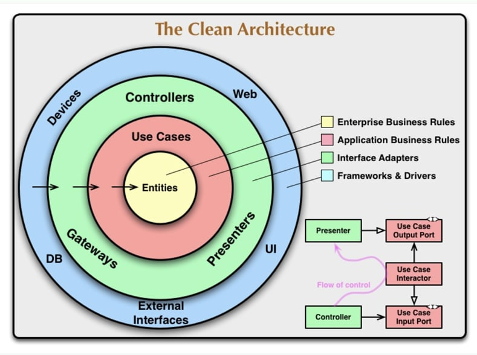
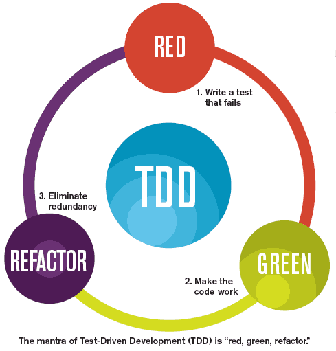

# TODO | JSONPLACEHOLDER | TDD | Clean Architecture

A Flutter project dedicated to improve/practice the Test Driven Development and Clean Architecture concepts.

Using a basic Rest API to build this project, JSONPLACEHOLDER is a open request source to test request and practice C.R.U.D. on Front-end, event Back-end.

### API LINK:

<a href="https://jsonplaceholder.typicode.com/" target="_blank">Json Place Holder API</a>

## Clean Architecture Example

  Clean Architecture is an approche to develop your project with principles that make it clean, maintanable and without concret dependencies,
  Although be difficult to write those layer and code, it's ensure quality to your project, is interchangeable dependencies that make easily to
  access other implementation, without dirty code and rich of SOLID principles.

## Test Driven Development

  Test Driven Development is a simple approche to develop more careful your business rules, create some functionality is necessary
  ensure that shall handle sucess, errors and exceptions. Since you have a notion the intention of your code, o must write a simple test, expectating the success,
  but it must have failed, after that you'll write the frst happy return, after that, come with a cenarious when this method can fail. Thus, rewrite your code to handle possibles exceptions and finally get back to the their tests and ensure again that is handling correctly. Nevertheless, you wrote a good feature. It's the TDD.

